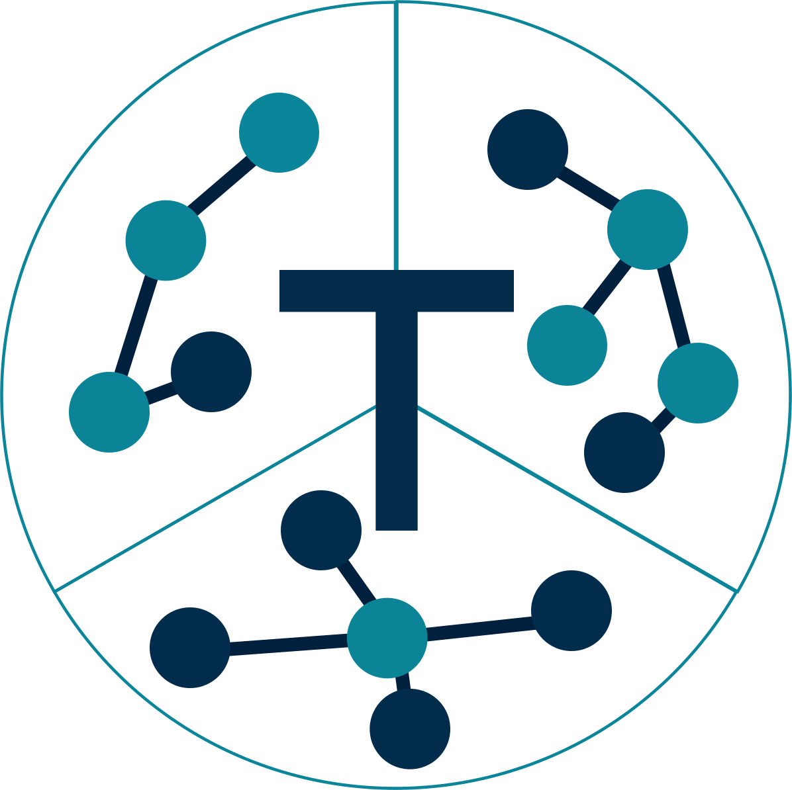

[](https://pypi.org/project/tripper)
[](https://emmc-asbl.github.io/tripper/latest/)
[](https://github.com/EMMC-ASBL/tripper/actions/workflows/ci_tests.yml?query=branch%3Amaster)
[](https://zenodo.org/badge/latestdoi/547162834)

*Triplestore wrapper for Python providing a simple and consistent interface to a range of triplestore backends*


Tripper
=======

Getting started
---------------
* [Tutorial]
* [Documentation]
* [Reference manual]


Basic concepts
--------------
Tripper provides a simple and consistent interface to a range of triplestore backends.
It strives for simplicity and is modelled after [rdflib] (with a few simplifications).

In Tripper:

* All IRIs are represented by Python strings.
  Example: `"https://w3id.org/emmo#Metre"`

* Blank nodes are strings starting with "_:".
  Example: `"_:bnode1"`

* Literals are constructed with [`tripper.Literal`][Literal].
  Example: `tripper.Literal(3.14, datatype=XSD.float)`

To make it easy to work with IRIs, provide Tripper a set of pre-defined namespaces, like `XSD.float`.
New namespaces can be defined with the [`tripper.Namespace`][Namespace] class.

A triplestore wrapper is created with the [`tripper.Triplestore`][Triplestore] class.


Sub-packages
------------
Additional functionality beyond interfacing triplestore backends is provided by specialised sub-package:

* [tripper.datadoc]: An API for data documentation.
* [tripper.units]: Working with units and quantities defined in ontologies.
* [tripper.mappings]: Traverse mappings stored in the triplestore and find possible mapping routes.
* [tripper.convert]: Convert between RDF and other data representations.


Available backends
------------------
The following backends are currently available, either in Tripper or other packages.

| Backend name  | Provided by  | Requirements            | Comment
| ------------  | ------------ | ----------------------- | -----------------
| rdflib        | [tripper]    | rdflib                  | In-memory [rdflib] triplestore supporting all features.
| ontopy        | [tripper]    | EMMOntoPy               | Backend for [EMMOntoPy]. In-memory.
| sparqlwrapper | [tripper]    | sparqlwrapper           | Generic backend for all triplestores supported by [sparqlwrapper].
| collection    | [tripper]    | DLite-Python            | Backend to a [DLite] collection.
| graphdb       | [tripper]    | sparqlwrapper           | Backend to [GraphDB].
| fuseki        | [PyBackTrip] | sparqlwrapper           | Backend to [fuseki].
| stardog       | [PyBackTrip] | sparqlwrapper,pystardog | Backend to [StarDog].


Installation
------------
Tripper has by itself no dependencies outside the standard library, but the triplestore backends may have specific dependencies.


The package can be installed from [PyPI] using `pip`:

```shell
pip install tripper
```

In addition you would need to install the requirements for one or more of the backends listed in the table above.
For mappings you would also need to install [Pint].
For example:

```shell
pip install rdflib pint
```


License and copyright
---------------------
All files in this repository are licensed under the [MIT license].
If not stated otherwise in the top of the files, they have copyright &copy; 2022
SINTEF.


Acknowledgements
----------------
We gratefully acknowledge the following projects for supporting the development of Tripper:

  - [OntoTrans](https://ontotrans.eu/) (2020-2024) that receives funding from the European Union's Horizon 2020 Research and Innovation Programme, under Grant Agreement n. 862136.
  - [OpenModel](https://www.open-model.eu/) (2021-2025) that receives funding from the European Union's Horizon 2020 Research and Innovation Programme, under Grant Agreement n. 953167.
  - [SFI PhysMet](https://www.ntnu.edu/physmet) (2020-2028) funded by Forskningsrådet and Norwegian industry partners.
  - [DOME 4.0](https://dome40.eu/) (2021-2025) that receives funding from the European Union's Horizon 2020 Research and Innovation Programme, under Grant Agreement n. 953163.
  - [VIPCOAT](https://www.vipcoat.eu/) (2021-2025) that receives funding from the European Union's Horizon 2020 Research and Innovation Programme, under Grant Agreement n. 952903.
  - MEDIATE (2022-2025) that receives funding from the RCN, Norway; FNR, Luxenburg; SMWK Germany via the M-era.net programme, project 9557,
  - [MatCHMaker](https://he-matchmaker.eu/) (2022-2026) that receives funding from the European Union's Horizon 2020 Research and Innovation Programme, under Grant Agreement n. 101091687.
  - [PINK](https://pink-project.eu/) (2024-2027) that receives funding from the European Union's Horizon 2020 Research and Innovation Programme, under Grant Agreement n. 101137809.


[Tutorial]: https://emmc-asbl.github.io/tripper/latest/tutorial/
[Documentation]: https://emmc-asbl.github.io/tripper/latest/
[Reference manual]: https://emmc-asbl.github.io/tripper/latest/api_reference/triplestore/
[Discovery of custom backends]: https://emmc-asbl.github.io/tripper/latest/backend_discovery/
[tripper.datadoc]: https://emmc-asbl.github.io/tripper/latest/datadoc/introduction/
[tripper.mappings]: https://emmc-asbl.github.io/tripper/latest/api_reference/mappings/mappings/
[tripper.units]: https://emmc-asbl.github.io/tripper/latest/units/units/
[tripper.convert]: https://emmc-asbl.github.io/tripper/latest/api_reference/convert/convert/
[Known issues]: https://emmc-asbl.github.io/tripper/latest/known-issues/
[MIT license]: https://emmc-asbl.github.io/tripper/latest/LICENSE/
[tripper]: https://emmc-asbl.github.io/tripper
[rdflib]: https://rdflib.readthedocs.io/en/stable/
[PyPI]: https://pypi.org/project/tripper
[PyBackTrip]: https://github.com/EMMC-ASBL/PyBackTrip/
[Literal]: https://emmc-asbl.github.io/tripper/latest/api_reference/triplestore/#tripper.triplestore.Literal
[Namespace]: https://emmc-asbl.github.io/tripper/latest/api_reference/triplestore/#tripper.triplestore.Namespace
[Triplestore]: https://emmc-asbl.github.io/tripper/latest/api_reference/triplestore/#tripper.triplestore.Triplestore
[EMMOntoPy]: https://emmo-repo.github.io/EMMOntoPy/stable/
[sparqlwrapper]: https://sparqlwrapper.readthedocs.io/en/latest/
[DLite]: https://sintef.github.io/dlite/
[fuseki]: https://jena.apache.org/documentation/fuseki2/
[StarDog]: https://www.stardog.com/
[GraphDB]: https://www.ontotext.com/products/graphdb/
[Pint]: https://pint.readthedocs.io/en/stable/
