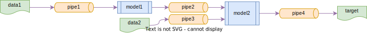

Generic example
===============
This example populates a knowledge base with information about some data sources and models.

It then asks OntoFlow how the `target` data can be obtained given the data and models that the knowledge base have been populated with.

We expect to find the following workflow

When the data sources and sinks are documented using partial pipelines, the workflow may also be represented as follows

Each of the 4 pipelines consist of two partial pipelines, one documenting the data source and one documenting the data sink.
For example, `pipe1` has a partial pipeline documenting the data source `data1` and a partial pipeline documenting the input to `model1`.
Similar for the other pipelines.

The important information that we have populated the knowledge base with in this generic example is shown below, where the red arrows correspond to mapping relations and `A`, `B`, `C` and `D` are ontological concepts.

