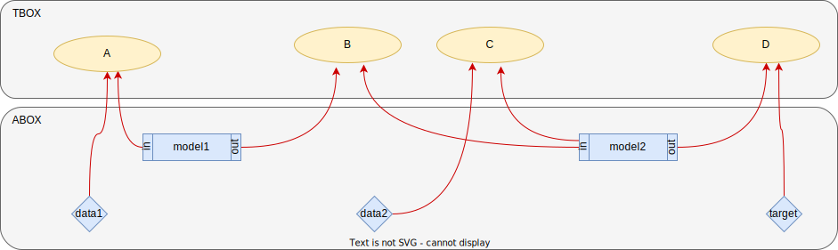
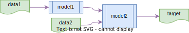
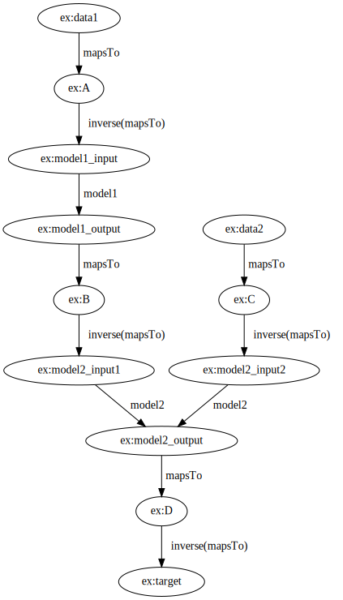

Workflow example
================
This example is implemented in the [workflow_example.py] script.
It populates a knowledge base with individuals standing for two
data sources (`data1` and `data2`) a `target` and two model (`model1` and
`model2`).
The input and output of the models is also documented.

We also add mappings from the data sources and model input/output to the
ontological concepts `A`, `B`, `C` and `D` as shown with red arrows in the
following figure.



We then ask tripper how the `target` data can be obtained given the data
and models that the knowledge base have been populated with, by calling

```python
routes = mapping_routes(
    target=EX.target,
    sources=(EX.data1, EX.data2),
    triplestore=ts,
)
```


We expect to find one mapping route representing the following workflow



Finally we visualise the mapping route by calling

```python
routes.visualise(0, output="route.svg", format="svg")
```

which should produce the following graph:




 [workflow_example.py]: https://github.com/EMMC-ASBL/tripper/blob/master/examples/workflow-mappings/workflow_mappings.py
